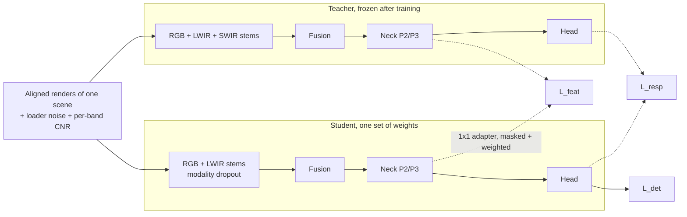

# Multispectral Aerial Target Detection — Build Specification

BSCS Final Year Project · Synthetic-data RGB + LWIR detector with a SWIR-privileged teacher

## 1. Project Summary

This project builds a passive computer-vision detector for one small fixed-wing UAV (the target aircraft, section 2), trained entirely on synthetic imagery rendered in Blender/BlenderProc. Three aligned bands are rendered from each scene: RGB, LWIR (8–14 µm) and SWIR (0.9–1.7 µm). A teacher detector uses all three bands. One student model accepts RGB + LWIR, LWIR only or RGB only, and is trained to reproduce the teacher's features and outputs for the same scene, so that what SWIR (and RGB) show during training carries over to cases where the student's own input is weak (section 7.2).

**Research question.** Does training-only SWIR transfer useful information to an RGB + LWIR student, especially when the target is only 2–16 px across? **Sub-question:** when the student sees LWIR alone, does cross-modal distillation raise detection on targets whose LWIR contrast is weak but whose SWIR contrast was strong in the same scene?

**Primary variable.** Apparent target size in pixels, reported in six bins: 2–4, 4–8, 8–16, 16–32, 32–64, 64+ px (binned by the larger side of the projected box). Range in metres is secondary and reported as a band derived from the target-size range.

All geometry and signature values below are modelling ranges held in YAML configs. Dimensions are measured values with their uncertainty; code must never hard-code them.

**Companion files.** Drone model code and references: `fyp/` (section 2.1). Sky, background and haze setup: `FYP_Sky_and_Background.md`.

## 2. Target Model (Phase 1)

A parametric, low-polygon 3D mesh of the target airframe in real metres: a tailless cropped delta with a long, blunt-nosed fuselage, tip fins above and below the wing, and an exposed flat-twin engine driving a two-blade pusher propeller. The model is already implemented in the `fyp/` package; this section is its specification and the record of where every number came from.

### 2.1 Files and frames

| File | Role |
| --- | --- |
| `configs/target.yaml` | Single source of truth: every dimension with its default, sampled range and photo source |
| `target/kal_geometry.py` | Pure-NumPy mesh generator, consistency rules, variant sampler (no Blender needed) |
| `target/kal_measure.py` | Reads dimensions back from the mesh and checks them against the YAML; ray-cast visibility of hot parts by aspect |
| `target/_yamlite.py` | Strict YAML-subset loader used when PyYAML is missing (Blender's bundled Python has none) |
| `target/build_target.py` | `build_target(params)` → Blender object with material slots, decal UVs, smooth shading; CLI writes `.blend` files and orthographic previews |
| `tools/draw_reference.py` | Four-view drawing (top, side, front, rear) projected from the same mesh → `docs/reference/kal_views.{png,svg}` |
| `tools/photo_check.py` | Fits a camera to each reference photo and overlays the mesh → `docs/reference/overlay_*.png` |
| `tools/make_decals.py` | Decal texture atlas (wing lettering, fin wordmark, flag) → `assets/decals/` |
| `tests/test_geometry.py` | Closed-mesh, range, determinism and size tests |

Because the drawing, the photo overlay and the Blender object are all generated from one mesh function, they cannot diverge. Change a number only in `target.yaml`, then rerun the acceptance tests in section 2.9.

**Internal frame** (YAML and drawing): span units, x aft from the wing apex, y to starboard, z up. **Output frame** (Blender): metres, +X forward, +Y port, +Z up, origin on the fuselage axis midway between the nose tip and the propeller hub.

### 2.2 Evidence

No dimensions have been published (checked: manufacturer statements, press coverage, the encyclopaedia entry — only mass, payload and range are public). All geometry is measured from photographs in `docs/reference/photos/`.

| Key | Photo | Used for | Weight |
| --- | --- | --- | --- |
| P1 | Promotional render, oblique from above | Centreline stations (nose, collar, pod, neck, engine, hub), elevon layout, markings | Medium. Its fuselage is ~35% slimmer than the flying article, so no diameters are taken from it |
| P2 | Launch vehicle at sunset, 3/4 view | Nose probe and two antennas, fin height and above/below split, fin taper and TE angle, forebody diameter against the vehicle | Medium (low resolution, strong perspective) |
| P3 | Exhibition close-up of the upper surface | Satin finish (clear specular reflections), lettering, panel seams and hatches | Appearance only |
| P4 | Underside on the launcher (broadcast frame) | Flat-twin engine with sideways cylinders, two exhaust headers, bullet spinner, fuselage protruding below the wing, lower fins, straight TE with elevons | High for the engine |
| P5 | Elevated view on the launch vehicle | Overall length against the vehicle wheelbase (3.1–3.5 m) | Low (180 px image) |
| P6, P7 | Flight silhouettes from below | Nose/root and tip/root ratios, forebody/span; photo-check targets | High |
| P8 | Near-axial rear view on the launcher | Fin heights and above/below split against span (fins and wing tips at one depth), engine width, elevon break at y ≈ 0.29, lettering readable from behind | High for the fins |

A low-resolution exhibition frame was discarded: it adds nothing beyond P3. The absolute scale uses a Toyota Hilux double cab (wheelbase 3.085 m, height 1.815 m) as the reference object.

**What the photos cannot fix.** No single photo constrains root chord relative to span: a weak-perspective camera fitted to any of them reaches the same error for root chord 0.90, 1.00 and 1.12 (`tools/photo_check.py` prints this). Root chord/span therefore carries the widest range, and sweep and length are derived from it. The same holds for absolute span.

### 2.3 Parameters

Span units unless stated; metres at the default span of 2.30 m in brackets. The sampler draws uniformly inside every range and resamples until the consistency rules in section 2.7 hold.

| Group | Parameter | Default | Range | Source |
| --- | --- | --- | --- | --- |
| Scale | Wingspan | 2.30 m | 2.00–2.60 m | P5 length, P2 forebody vs vehicle |
| Planform | Root chord | 1.00 (2.30 m) | 0.90–1.12 | P5 length / P6 forebody ratio; not directly observable |
| | Tip chord / root chord | 0.17 (0.39 m) | 0.13–0.21 | P1 0.20, P6 0.19, P7 0.11 (banked) |
| | Nose tip ahead of wing apex / root chord | 0.27 (0.62 m) | 0.23–0.30 | P1 0.26, P6 0.29, P7 0.24 |
| | Leading-edge sweep | **derived** 58.9° | must fall in 54–63° | atan((root − tip) / 0.5) |
| | Wing thickness / chord | 0.06 | 0.04–0.09 | Not visible; thin enough that the fuselage stands proud on both surfaces |
| | Wing height on fuselage | mid-wing (0) | ±0.015 | Fuselage protrudes above (P1, P3) and below (P4) |
| Elevons | Chord / root chord | 0.09 (0.21 m) | 0.07–0.11 | P1 |
| | Spanwise stations | inner 0.085–0.285, outer 0.285–tip | fixed | P1 |
| Fuselage | Forebody diameter | 0.140 (0.32 m) | 0.125–0.155 | P6 13/89 px, P7 15/100 px |
| | Nose dome length / forebody diameter | 0.90 | 0.70–1.10 | Blunt ellipsoidal nose |
| | Tube diameter / forebody | 0.72 (0.23 m) | 0.64–0.80 | P1: body steps down behind the collar |
| | Aft pod max diameter / forebody | 0.92 (0.30 m) | 0.85–1.00 | P1, P4 |
| | Neck diameter / forebody | 0.45 (0.14 m) | 0.38–0.55 | P1 |
| | Pod start, pod max, neck / root chord | 0.60, 0.73, 0.92 | ±0.04, ±0.04, ±0.03 | P1 |
| | Collar (forebody ends) | **derived**: where the LE meets the forebody | — | P1 |
| | White band | 0.020 wide, ending 0.010 ahead of the collar | fixed | P1 |
| Tip fins | Height above the wing | 0.15 (0.35 m) | 0.12–0.17 | P8 0.15–0.16; P2 consistent once its nose-nearer perspective is allowed for |
| | Height below the wing | 0.15 (0.35 m) | 0.12–0.18 | P8 0.14–0.16 (split about even); P1, P2 hint at slightly more below |
| | Root chord | 0.125 (0.29 m) | 0.10–0.15, ≤ wing tip chord | P2 |
| | Tip chord (top and bottom) | 0.035 | 0.02–0.05 | P2 |
| | TE rake | 0° (TE perpendicular to the wing) | ±8° | P2 |
| Engine | Start / root chord, length / root chord | 0.96, 0.10 (0.23 m) | 0.93–1.00, 0.08–0.12 | P1 |
| | Width across cylinder heads | 0.140 (0.32 m) | 0.12–0.16 | P4 heads just outboard of the pod; P8 envelope 0.14–0.16 |
| | Exhaust | two headers from the heads, curving down and aft to outlets 0.045 below the axis | fixed | P4 (outlet position low confidence) |
| | Propeller hub aft of TE / root chord | 0.085 (0.20 m) | 0.05–0.12 | P1 |
| Propeller | Diameter | 0.28 (0.64 m) | 0.24–0.33 | P1, P6 |
| | Spinner | bullet, 0.03 long | fixed | P4 |
| Nose details | Forward probe | 0.04 long (0.09 m) | fixed | P2 (the P1 render omits it) |
| | Blade antennas | two, 0.06 and 0.09 behind the nose tip, 0.03 tall | fixed | P2 |

**Derived at the defaults:** length nose tip to hub 1.355 span = 3.12 m (3.21 m with probe); across sampled variants 2.4–4.0 m, 5th–95th percentile 2.7–3.7 m. Length exceeds span, so length sets the box in broadside and planform views.

### 2.4 Reference drawing


`docs/reference/kal_views.png` is generated from the mesh (`python tools/draw_reference.py`). It has top, side, front and rear views at one scale; the rear view matches photo P8 and shows the engine, exhaust headers and fin split that matter most in LWIR. The side view shows the wing edge-on, both fins above and below the wing, the engine with its exhaust headers, and the nose probe and antennas. Blender renders of the same object are in `docs/reference/blender_previews/`.

**Key stations at the defaults** (x in span units from the wing apex; aft positive):

| Station | x | Note |
| --- | --- | --- |
| Probe tip | −0.310 | |
| Nose tip | −0.270 | Blunt ellipsoidal dome to −0.144 |
| Antennas | −0.210, −0.180 | Two blades on the upper nose |
| Flag decal | −0.060 | Upper forebody |
| White band | +0.086 to +0.106 | |
| Collar | +0.116 | LE meets the forebody; body steps down to the tube |
| Wing tip LE | +0.830 | At y = ±0.5 |
| Aft pod | +0.60 start, +0.73 max | |
| Neck | +0.92 | |
| Engine | +0.96 to +1.06 | Cylinder heads sideways |
| Trailing edge | +1.000 | Straight; fin TEs on this line |
| Propeller hub | +1.085 | |

### 2.5 Configuration and appearance

Cropped-delta planform with a straight trailing edge and two elevon panels per side. A long blunt-nosed forebody of larger diameter runs back to a collar where the leading edge meets it, carries a white band just ahead of the collar, then steps down to a slimmer tube, swells into an aft pod and narrows to a neck at the engine. Mid-mounted thin wing. Tall, swept, strongly tapered fin plates on both tips (total height about 0.30 of the span), extending about as far above the wing as below, with trailing edges on the wing TE line. P8 shows a small horizontal fitting near each lower fin tip; it is not modelled (under 0.04 of the span). An uncowled flat-twin engine with finned cylinder heads protruding sideways just beyond the pod, two exhaust headers curving down and aft, and a two-blade pusher propeller with a bullet spinner. A short forward probe at the nose tip and two small blade antennas on the upper nose.

**Finish and markings:** near-black to dark grey paint with a satin sheen (P3 shows clear reflections; under open sky it reads blue-grey). White lettering on both upper wing panels, readable from behind; a white wordmark on both fin outer faces; the white forebody band; a small flag decal on the upper forebody. All markings live in the `markings` (band) and `decal` (textured quads) slots.

**What each feature contributes by apparent size** (larger box side in pixels):

| Feature | Becomes useful at |
| --- | --- |
| Overall outline and aspect ratio | 2–8 px (blob elongation only) |
| Delta planform shape | 8–16 px |
| Forebody and nose ahead of the wing | 16–32 px |
| Tip fins | 16–32 px (front, rear, side), 32–64 px (planform) |
| Slimmer tube, aft pod, neck | 32–64 px |
| Engine, cylinder heads, propeller disc | 32–64 px |
| Elevon panels | 32–64 px |
| Probe, antennas, markings | 64+ px |
| Hot engine and exhaust headers | LWIR at any size — can be the entire signature at 2–8 px |

### 2.6 Material slots

Each band assigns its own properties per slot; Phase 1 only fixes the slot names and which faces carry them.

| Slot | Faces |
| --- | --- |
| `skin` | Wing surfaces outside the elevons, wing tip caps |
| `control_surface` | Elevon panels (same paint as skin; separate so they can be deflected or varied) |
| `fin` | Both tip fins |
| `fuselage` | Dome, forebody, tube, pod |
| `tail_cone` | Neck and aft end next to the engine (warmer in LWIR) |
| `markings` | White forebody band |
| `decal` | Alpha-textured quads: wing lettering, fin wordmark, flag (one atlas) |
| `engine_region` | Crankcase, cylinders, finned heads, shaft |
| `exhaust_outlet` | Both exhaust headers and their outlets (hottest parts) |
| `propeller` | Spinner and blades (`prop_mode: blades` or `both`) |
| `propeller_disc` | Thin disc standing in for the spinning propeller (translucent in RGB) |
| `antenna` | Nose probe and both blade antennas |
| `nose_window` | Off by default; not seen on this airframe |

### 2.7 Build and consistency rules

The generator (`build_mesh`) follows these rules; any new code must too:

1. The wing is lofted from closed symmetric airfoil sections at fixed spanwise stations. Every section has the same index layout (points LE→hinge clustered at the LE, three points hinge→TE), so faces never twist and the hinge line is one edge loop.
2. The fuselage is a body of revolution whose radius profile is `radius_at(x)`: dome, forebody, collar taper, tube, pod, neck.
3. Fins are thin plates centred on the tips; their outline shares the wing TE point.
4. Every part is a closed, consistently wound surface with outward normals (checked by `edge_report` and by signed volume). Decals are single-sided quads offset 1–2.5 mm above the surface.
5. Sweep and length are derived, never entered. A variant is rejected and resampled if: sweep leaves 54–63°; fuselage stations are out of order; the fin root chord exceeds the wing tip chord; the elevon chord exceeds 0.9 × tip chord; the engine overlaps the hub; the wing root is thicker than the fuselage tube; the antennas overlap the band.
6. No dimension is hard-coded in `.py` files; everything comes from `target.yaml`.

**Why a low-poly 3D mesh.** Flat 2D sprites cannot rotate consistently, cannot produce aligned RGB/LWIR/SWIR views from one pose, and cannot hide the exhaust by viewing angle. CAD-grade detail adds nothing below about 32 px, where most detection difficulty lies. The canonical mesh has about 1,100 faces.

### 2.8 Variant family

One canonical model plus variants from `sample_variant(cfg, seed)`: uniform draws inside every range in `target.yaml`, with a fixed seed per scene. Because the ranges are the measurement uncertainty, training across variants makes the detector robust to the model being slightly wrong, which matters most for root chord/span and absolute span. Store the full sampled parameter dict with each scene (section 6).

### 2.9 Acceptance tests

Run after any change to `target.yaml` or the generator:

1. `python target/kal_geometry.py` — prints the metre summary and reports no non-manifold edges.
2. `python target/kal_measure.py` — dimensions read back from the mesh match the YAML ("invariants: all hold"), plus the hot-part visibility table.
3. `pytest tests -q` — 41 tests pass (closed meshes, ranges, determinism, sizes, slots, mesh-vs-YAML, YAML loader, exhaust visibility).
4. `python tools/photo_check.py` — every photo's keypoint RMS under 3% of its projected span, and the overlay outlines match. Current: P1 2.8% (render: perspective and slimmer fuselage), P6 1.5%, P7 2.2%, P8 1.5% (pinhole camera, since that photo is taken close up).
5. `python tools/draw_reference.py` — regenerate the drawing and compare it with the Blender previews.
6. `blender -b -P target/build_target.py -- --variants 5 --out out/phase1` (or `python target/build_target.py ...` with the `bpy` module) — canonical plus five variants, each as `.blend` and top/side/front previews at one scale.

When a new reference photo arrives, add its keypoints to `tools/photo_check.py` and require it to pass.

### 2.10 Open measurements

In order of impact on results:

1. **Root chord / span** — sets sweep (54–63°) and length (2.4–4.0 m). Needs a near-perpendicular top or bottom view, or a true broadside view.
2. **Absolute span** — scales every range in section 5. Needs a published figure, or a photo with a known-size object at the same depth.
3. **Exhaust outlet position** — decides where the LWIR hot spot sits and from which aspects it is visible. Needs a rear or side close-up of the engine.
4. **Wing thickness** — needs a clean head-on or broadside view. (The fin above/below split is now measured by P8; its range stays open because P1 and P2 lean slightly towards more below.)

## 3. Signature Models (Phases 2–4)

Each band is a physics-based proxy with per-slot values sampled from ranges.

### 3.1 RGB (Phase 2)

- **Skin** (`skin`, `control_surface`, `fin`, `fuselage`, `tail_cone`): near-black to dark grey satin paint, albedo 0.03–0.08, roughness 0.3–0.6, clear-coat layer weight 0–0.5 (P3 shows clear reflections; under open sky the finish reads blue-grey).
- **Markings:** white paint, albedo 0.70–0.85 (`markings` band; `decal` atlas for upper-wing lettering, fin wordmark and flag).
- **Lighting:** Blender sky model for day and dusk, including sun near the line of sight; night at starlight/moonlight levels with long exposure.
- **Motion blur:** blur length ≈ f_px × V × t_exp / Z. Airspeed default 44 m/s (160 km/h), sampled 39–56 m/s, plus 0–15 m/s wind for apparent motion. At 44 m/s, the 50 mm narrow camera (f ≈ 4,170 px) and 1 km range, a 5 ms exposure gives about 0.9 px of blur; a 50 ms night exposure gives about 9 px.
- **Haze:** exponential extinction with range; RGB contrast drops fastest of the three bands.
- **Noise:** shot + read noise on the linear render before tone mapping (Brooks et al., CVPR 2019).

### 3.2 LWIR (Phase 3)

Temperatures are offsets from ambient air (ΔT), converted to 8–14 µm radiance with Planck's law and per-slot emissivity, and rendered as emission.

| Slot | ΔT vs air | Emissivity | Reasoning |
| --- | --- | --- | --- |
| Airframe skin | −2 to +8 K | 0.85–0.95 | Painted surface; airflow holds skin near air temperature; sun warms dark paint by day, radiation to cold sky cools it at night |
| Engine block and cylinder heads (`engine_region`) | +60 to +200 K | 0.3–0.9 | Uncowled flat-twin, heads protruding sideways; cylinder heads typically 120–220 °C, crankcase cooler; low emissivity for bare aluminium fins, high if painted or oxidised |
| Exhaust headers and outlets (`exhaust_outlet`) | +150 to +450 K | 0.3–0.9 | Two pipes curving down and aft from the heads to outlets below the engine |
| Tail cone near engine (`tail_cone`) | +5 to +30 K | 0.85–0.95 | Heated by conduction and radiation from the engine |
| Propeller (`propeller`, `propeller_disc`) | 0 to +5 K | 0.85–0.95 | Unheated blades |
| Clear sky | −5 K near horizon to −50 K at high elevation | — | Effective sky temperature falls well below air temperature away from the horizon |
| Sun-heated ground and roofs | +10 to +40 K (day) | 0.9–0.97 | Warm-clutter case |
| Birds | +2 to +15 K surface | 0.95 | Feathers insulate the warm body |
| Light aircraft / helicopters | engine +50 K and up | — | Hard negatives with hot engines |

- **Ambient air:** sample −20 °C to +50 °C; desert day scenes sit at +35 °C to +50 °C.
- **Aspect dependence:** the engine sits behind the neck with its cylinder heads protruding just beyond the pod, so it is visible from the rear, the sides, above and below, and hidden only in a forward cone by the forebody and pod; the exhaust outlets under the engine are most exposed from below and behind. Ray casting on the model (`target/kal_measure.py`) gives: exhaust headers fully hidden from level head-on and from above in the front half; visible from below at every azimuth; engine region visible from everywhere except level head-on. At 2–8 px a rear or underside view may show little more than the hot engine.
- **Thermal crossover:** a dusk state with skin ΔT ≈ 0 and a cooler engine range.
- **Apparent radiance:** L = ε·L(T) + (1 − ε)·L(T_env). A ground camera looks up at the lower surfaces, which face the ground and low atmosphere, so T_env ≈ air temperature; without the reflected term a painted panel at air temperature reads several kelvin cold. Reference emissivities: paint 0.80–0.95, flat black lacquer 0.97, anodised aluminium 0.55, polished aluminium 0.04–0.06, stainless steel 0.16–0.45, rusty steel 0.69. Low-emissivity engine and exhaust parts therefore show partly reflected surroundings, and sun glints on them are possible in LWIR (not modelled).
- **Clear sky:** the −5 K to −50 K offsets give clear-sky temperatures well below 0 °C at high elevation, consistent with the clear-sky backgrounds of about −20 °C quoted in radiometry practice.
- **Atmosphere:** LWIR passes haze better than RGB; fog attenuates it strongly. Model the path as contrast attenuation against the sky: L_obs = τ(R)·L + (1 − τ(R))·L_sky, with τ = exp(−σR) and band-average σ sampled 0.15–0.8 km⁻¹ (dry, cool air to hot, humid air). Humid heat is the demanding case: a 100 m path at 35 °C and 80 % RH transmits only about 80 %. Enable it only together with RGB haze, so band comparisons stay fair.
- **Motion:** microbolometers respond over their thermal time constant (older cores sample at 1/30 s), so fast targets smear in LWIR too; use an equivalent exposure of 10–33 ms for LWIR motion blur.
- **Noise and tone mapping:** column fixed-pattern noise plus Gaussian noise at 20–60 mK NETD-equivalent (He et al., Applied Optics 2018); current 640×512 uncooled cores are specified between ≤20 mK and <50 mK, quoted for a 30 °C scene. Then a 14→8-bit mapping that mimics automatic gain control: a random linear window and at least one histogram-based variant, because the camera's tone mapping shapes what the detector sees. Keep the linear radiance so the mapping can change without re-rendering.

### 3.3 SWIR (Phase 4, teacher only)

Band 0.9–1.7 µm (typical InGaAs), rendered from per-slot reflectance under the scene illumination.

| Slot | Reflectance | Note |
| --- | --- | --- |
| Dark paint | 0.03–0.40 diffuse, plus specular layer | Carbon-black pigments stay dark in SWIR; many other black pigments turn bright, so randomize the full range. The satin finish adds a Fresnel specular term (about 4% at normal incidence) |
| White markings | 0.50–0.85 | Stays bright through most of the band, falling toward 1.7 µm |
| Engine metal (`engine_region`, `exhaust_outlet`) | 0.3–0.8 | Lower when oxidised or sooted |
| Camera window (`nose_window`) | Specular, glass-like | Not seen on this airframe; off |
| Vegetation | 0.3–0.5 | High below 1.3 µm, dropping at water bands |
| Clear sky | Darker than in visible | Rayleigh scattering falls with wavelength, giving SWIR its contrast and haze advantage against sky |

- **Night:** atmospheric nightglow, strongest around 1.4–1.8 µm — low but non-zero signal with higher noise.
- **Hot parts:** surfaces above roughly 250 °C emit measurably near 1.5–1.7 µm; the exhaust outlet may self-emit at night (optional switch).
- **Noise:** SWIR-specific synthetic noise (Jiang, Wang, Zheng, ICCVW 2025).

All noise is applied in the data loader, not baked into renders, so each epoch sees fresh noise without re-rendering.

## 4. Rendering Implementation

1. **Supersample, blur, integrate.** Render at 2× (1280×1024) by default and 4× for the 2–8 px bins. Convolve with a Gaussian point-spread function — σ in output pixels: RGB 0.3–0.6, SWIR 0.4–0.7, LWIR 0.4–0.9 — then box-average to 640×512. LWIR gets the widest blur because diffraction scales with wavelength × F-number; for the S1 camera (f/1.0, 12 µm pixels) diffraction alone gives σ ≈ 0.42·λ·N / pitch ≈ 0.35 px at 10 µm, and the rest of the range covers lens aberrations and defocus. Turn Cycles denoising off for target frames; it smears tiny objects.
2. **Bin-targeted range solving.** Sample orientation first, project the mesh vertices to get projected width W_proj, then set range Z = f_px × W_proj / p_target with p_target drawn inside the chosen bin. Place the target along a random ray in the field of view and verify the rendered box lands in the bin.
3. **Ground-truth boxes.** Compute boxes from projected mesh vertices, not rendered masks — at 2–4 px a faint target's mask can be empty or fragmented. Store per-band contrast-to-noise, (target mean − local background) / noise σ, so results separate "too small" from "too faint."
4. **LWIR recipe.** Emission-only Cycles pass with no lights. Each material becomes Emission with strength = apparent in-band radiance ε·L(T) + (1 − ε)·L(T_air) (section 3.2) from a precomputed Planck lookup table (8–14 µm, 200–800 K, 0.01 K steps). The world shader carries sky radiance as a function of elevation. Save linear float EXR, map to 14-bit counts with random gain and offset, add fixed-pattern noise in the loader.
5. **SWIR recipe.** Greyscale reflectance pass: each material's base colour = its SWIR reflectance; keep the sun and scale sky strength down 3–30× relative to the visible render. At night, replace the sun with dim uniform airglow illumination.
6. **Registration offsets.** During training, shift LWIR against RGB by 0–2 px and 0–1° rotation so fusion does not rely on perfect alignment.
7. **Sky, background and haze.** Specified in `FYP_Sky_and_Background.md` (procedural sky, sun lamp, camera and film settings, Mist-pass haze, ground plane, and the sky acceptance test to run before the LWIR pass).
8. **Sim-to-real checks.** When real-sensor results disagree with synthetic ones, check in order: geometry, material and thermal ranges, noise levels, blur, atmosphere, registration, background statistics, training diversity.

In-band LWIR radiance used by the lookup table (integrate numerically once with NumPy; 1,000 wavelength steps is ample):

```latex
L(T) = \varepsilon \int_{8\,\mu m}^{14\,\mu m} \frac{2hc^2}{\lambda^5} \frac{1}{e^{hc/\lambda k T} - 1}\, d\lambda
```

## 5. Sensor Profile and Pixel-to-Distance

**Sensor profile S1:** 640×512 for RGB, LWIR and SWIR (the standard format of current uncooled LWIR cores, and the visible resolution of the Halmstad dataset), 12 µm pixels, f/1.0 optics. Two focal lengths from the common 14–75 mm LWIR continuous-zoom range: wide 14 mm (HFOV 30.7°) and narrow 50 mm (HFOV 8.8°). The RGB and SWIR cameras are zoomed to the same field of view and rendered at the same format, so all bands are pixel-aligned. Thermal sensitivity 20–50 mK; frame rate 30–60 Hz. This is the most widely fielded class of ground-based day/night pan-tilt camera, which pairs such a core with an HD daylight zoom camera. Milestone 1 uses the 50 mm narrow profile only.

```latex
p_x = \frac{N_x \, W}{2 Z \tan(\mathrm{HFOV}/2)}
```

W is the projected target extent, Z is range, N_x = 640. f_px = focal length ÷ pixel pitch = 1,166.7 at 14 mm and 4,166.7 at 50 mm; one pixel subtends 0.86 mrad and 0.24 mrad respectively.

**Range at which the target reaches each bin's lower edge.** The airframe is longer than it is wide, so two cases bound the range: span-limited (head-on or tail-on; span 2.00–2.60 m, default 2.30 m) and length-limited (broadside or planform; nose-to-hub length 2.67–3.72 m across sampled variants, 5th–95th percentile, default 3.12 m). Defaults in brackets.

| Pixel bin | 14 mm, span-limited | 14 mm, length-limited | 50 mm, span-limited | 50 mm, length-limited |
| --- | --- | --- | --- | --- |
| 2–4 px | 1,167–1,517 (1,342) | 1,558–2,170 (1,820) | 4,167–5,417 (4,792) | 5,562–7,750 (6,500) |
| 4–8 px | 583–758 (671) | 779–1,085 (910) | 2,083–2,708 (2,396) | 2,781–3,875 (3,250) |
| 8–16 px | 292–379 (335) | 389–543 (455) | 1,042–1,354 (1,198) | 1,391–1,938 (1,625) |
| 16–32 px | 146–190 (168) | 195–271 (228) | 521–677 (599) | 695–969 (813) |
| 32–64 px | 73–95 (84) | 97–136 (114) | 260–339 (299) | 348–484 (406) |
| 64+ px | 36–47 (42) | 49–68 (57) | 130–169 (150) | 174–242 (203) |

Distances are pure geometry; atmospheric path loss (section 3.2) reduces contrast, not size. Below about 2 px, detectability depends on contrast and point-spread rather than size. Placement (section 4 step 2) always uses the projected box of the actual variant and pose, so these tables are for reporting only.

## 6. Dataset

**Starter size:** 600–900 aligned scenes; two background families (open sky; horizon with terrain and structures); day, dusk, night; six pixel bins balanced; 0–3 hard negatives per scene; 70/15/15 train/val/test split by scene with no scene in more than one split.

**Classes:** `0 target`, `1 bird`, `2 kite`, `3 light_aircraft`, `4 helicopter`, `5 small_uav`, `6 warm_clutter`.

**Per-scene metadata (one JSON per scene):**

```json
{
  "scene_id": "s000123",
  "split": "train",
  "seed": 123,
  "camera": {"focal_mm": 50, "pixel_pitch_um": 12, "width": 640, "height": 512, "f_px": 4166.7, "supersample": 4, "exposure_ms": 5},
  "target": {
    "variant": {"seed": 123, "span_m": 2.30, "root_chord": 1.00, "tip_over_root": 0.17,
                "nose_over_root": 0.27, "sweep_deg": 58.9, "forebody_dia": 0.140,
                "fin_up_height": 0.15, "fin_down_height": 0.15, "prop_dia": 0.28, "length_m": 3.12,
                "params_file": "params/s000123.json"},
    "yaw_deg": 30.0, "pitch_deg": 2.0, "roll_deg": 0.0,
    "range_m": 1041.7, "elevation_deg": 8.0,
    "airspeed_mps": 44.0, "wind_mps": 5.0,
    "projected_size_m": {"w": 2.25, "h": 0.55},
    "bbox_px": {"x": 312.4, "y": 201.7, "w": 9.0, "h": 2.2},
    "size_bin": "8-16"
  },
  "conditions": {"lighting": "dusk", "weather": "haze", "visibility_km": 8,
                 "background": "horizon_clutter", "thermal_state": "crossover", "air_temp_c": 24},
  "modalities": {
    "rgb":  {"path": "rgb/s000123.exr",  "cnr": 3.2},
    "lwir": {"path": "lwir/s000123.exr", "cnr": 6.8},
    "swir": {"path": "swir/s000123.exr", "cnr": 4.1}
  },
  "negatives": [{"class": "bird", "bbox_px": {"x": 90.0, "y": 150.0, "w": 5.0, "h": 3.0}, "range_m": 400.0}]
}
```

`variant` repeats the headline parameters (span units unless named `_m`); `params_file` holds the complete dict returned by `sample_variant`, so any scene's target can be rebuilt exactly. `bbox_px` is COCO-style (x, y = top-left corner). Annotations are also exported in COCO format for the detector. Milestone 1 uses a reduced version of this schema, defined in `docs/m1_contract.md`.

## 7. Detection Architecture

Single-frame detection.



### 7.1 Detector

- **Core:** lightweight one-stage YOLO-family detector; per-band input stems; mid-level feature concatenation fusion. Teacher = RGB + LWIR + SWIR; student = RGB + LWIR stems, used with any subset of them.
- **Low-cost additions:** modality dropout during training; hard negatives as labelled classes.
- **Optional:** SE-style adaptive modality weighting; SLPA small-object module.
- **Resolution:** train and test at native 640×512 (letterboxed to 640 if square input is required); never downscale.
- **Augmentation:** cap scale-down and mosaic shrinking so 2–4 px targets never fall below 1 px; allow scale-up. Apply identical geometric augmentation to every band of a scene so teacher and student see the same pixels.
- **Detection head:** YOLO strides of 8/16/32 px make the finest grid cell larger than a 2–8 px target. Run the baseline once without a stride-4 P2 head to document the gap, then add it.
- **Matching:** IoU is unstable for tiny boxes (a one-pixel diagonal shift of a 3×3 box drops IoU to about 0.3). For the 2–16 px bins, report AP50 alongside a centre-distance or Normalized Wasserstein Distance match.

### 7.2 Cross-modal privileged distillation

**Idea.** Synthetic data gives every scene in all three bands with identical geometry and labels. The student is trained so that, from whatever bands it receives, its internal features at a target resemble the teacher's features computed from all three bands of the same scene. Where a target is faint in LWIR but clear in SWIR or RGB, the student learns which faint LWIR patterns go with a real target. At test time an LWIR-only image can then produce a detection that an LWIR-only-trained model would miss. This is learning with privileged information, in the spirit of modality hallucination (Hoffman et al., 2016), without adding any network at inference.

**Limit.** Distillation can only amplify evidence that is present in the student's input. A target whose LWIR contrast is below the noise floor stays undetectable from LWIR alone. The evaluation includes a control bucket for this (section 8).

**Why it suits this target.** LWIR-weak/SWIR-strong cases arise naturally: the forebody and pod hide the engine and exhaust in a head-on approach (ray casting on the model, section 3.2), the airframe sits near ambient, and thermal crossover and warm clutter erase contrast, while the dark airframe against sky stays clear in SWIR and RGB.

**Training.**

1. Train the teacher (RGB + LWIR + SWIR) with the detection loss alone; freeze it.
2. Train one student with modality dropout per batch: RGB + LWIR 50%, LWIR only 30%, RGB only 20%. A dropped band enters as zeros plus a per-band presence flag broadcast as an extra channel into the fusion block. The teacher always receives all three bands of the same scene.
3. Loss: `L = L_det + λ_r · L_resp + λ_f · L_feat`, with λ_r = λ_f = 1 as starting values (tune on validation).
   - `L_resp`: soft-label distillation of class/objectness scores (temperature 2) and box distributions at teacher-positive locations.
   - `L_feat`: at the P2 and P3 neck outputs, a 1×1 adapter maps the student feature to the teacher's channel count; both are standardised per channel; the loss is a weighted MSE with mask `M = Σ_i ω_i · G_i + 0.05`. `G_i` is a Gaussian centred on object *i* (σ = max(1 cell, half the box size in cells)); the 0.05 floor also transfers the teacher's "nothing here" on clutter. Adapters are discarded after training.
   - Per-object weight `ω_i = 1 + β · clip((C_T,i − C_S,i) / 5, 0, 1)`, β = 2. `C_T,i` is the largest per-band CNR of object *i* over the teacher's bands, `C_S,i` the largest over the bands the student received in that batch. CNR is computed in the loader after noise (box mean minus 2-px annulus mean, over annulus standard deviation). The weight concentrates learning on objects the teacher sees much better than the student does, which is exactly the LWIR-weak/SWIR-strong case.
4. Rules: the teacher never runs at test time; test inputs are only the student's bands. Sample the per-band signature parameters independently (no shared latent between LWIR temperatures, SWIR reflectances and RGB albedo), so geometry is the only thing the bands share; otherwise the student can learn a synthetic shortcut that does not exist in real sensors.

**Cost.** About 150 lines on top of response distillation (mask builder, two 1×1 adapters, CNR weights) and one frozen teacher forward pass per batch (roughly 40–60% more training time). No extra parameters or latency at inference.

**Stretch, only if time allows:** a Hoffman-style hallucination branch, a small conv block that predicts the teacher's SWIR-stem features from LWIR and feeds them to the fusion as a pseudo-SWIR input.

## 8. Evaluation

- **Metrics:** precision, recall, AP50, AP50:95, false positives per image broken down by hard-negative class — overall, per pixel bin, per condition (day, dusk, night, haze, thermal crossover, warm clutter) and per aspect (head-on ±30°, beam, tail-on ±30°).
- **Size reference:** thermal-camera makers' guidance puts the practical limit of general-purpose detectors near 10×10 px and treats more than 10×10 px as detection, about 20×10 px as recognition and about 30×20 px as identification; an uncooled LWIR camera can register a 2×2 px warm cluster against a cold sky. Report where each model's detection-vs-size curve crosses these sizes.
- **Models compared on identical test scenes:** RGB-only, LWIR-only, RGB + LWIR baseline, RGB + LWIR + SWIR teacher, and the student ablation: + modality dropout → + response distillation → + masked feature distillation → + CNR-gap weighting. Every student is tested three times: RGB + LWIR, LWIR only, RGB only.
- **Contrast buckets** (test-set noise frozen with a fixed seed; per-object CNR after noise): LWIR-weak/SWIR-strong (C_LWIR < 2, C_SWIR ≥ 4); LWIR-weak/RGB-strong (C_LWIR < 2, C_RGB ≥ 4); all-weak control (every band < 2); LWIR-strong (C_LWIR ≥ 4). Report the object count in each.
- **Primary test of section 7.2:** recall at 0.01 false positives per image in the LWIR-weak/SWIR-strong bucket with LWIR-only input — feature-distilled student vs LWIR-only baseline vs response-only student — with bootstrap confidence intervals, and with hard-negative false positives shown alongside.
- **Expected pattern:** a gain in the LWIR-weak/SWIR-strong bucket, little or none in the all-weak control. A gain in the control points to label leakage or a synthetic shortcut and must be investigated before any claim is made.
- **Central plots:** detection probability vs. pixel size, and vs. range (as a band from the span range), with bootstrap confidence intervals.
- **Negative result is valid:** if the teacher does not beat the RGB + LWIR baseline, or the distilled student shows no bucket gain, report that SWIR gave no transferable benefit under these assumptions.
- **Real-sensor check (zero-shot):** Anti-UAV and Halmstad datasets, used only for sensor-domain behaviour and bird/aircraft confusions. The LWIR-only student can be run on their thermal streams directly.

## 9. Build Phases

| Phase | Work | Output |
| --- | --- | --- |
| 1 | Parametric target model (implemented; see section 2.9 to verify) | `build_target(params)`, YAML config, previews, reference drawing, photo check |
| 2 | RGB materials, lighting, blur, haze, noise | RGB renders + metadata |
| 3 | LWIR per-slot ΔT/emissivity, aspect-dependent exhaust, FPN noise | Pixel-aligned LWIR renders |
| 4 | SWIR per-slot reflectance, nightglow, SWIR noise | Pixel-aligned SWIR renders |
| 5 | Dataset generation | Dataset + per-scene metadata + COCO labels |
| 6 | Baselines, teacher, student with cross-modal distillation (section 7.2) | Results by bin, condition, aspect and contrast bucket |
| 7 | Zero-shot real-sensor check; ONNX CPU latency | Validation and edge-proxy report |

Do not start with custom attention/gating, large 3D worlds, 2,700+ scenes, custom radiometric calibration, or edge optimization.

**Suggested repository layout:**

```
fyp/
  configs/        target.yaml  render.yaml  sensors.yaml  signatures.yaml
  target/         kal_geometry.py  kal_measure.py  build_target.py  _yamlite.py   (exists)
  tools/          draw_reference.py  photo_check.py  make_decals.py   (exists)
  assets/decals/  decal_atlas.png  decal_atlas.json      (exists)
  docs/reference/ kal_views.png  overlay_*.png  blender_previews/  photos/   (exists)
  render/         scene.py  placement.py  rgb.py  lwir.py  swir.py  psf.py  backgrounds.py
  thermal/        planck_lut.py
  noise/          rgb_noise.py  lwir_fpn.py  swir_noise.py
  data/           writer.py  dataset.py  coco_export.py
  models/         stems.py  fusion.py  detector.py  distill.py (response + masked feature KD, CNR weights)
  train/          train_baseline.py  train_teacher.py  train_student.py (modality dropout, frozen teacher)
  eval/           bins.py  nwd.py  metrics.py  plots.py
  tests/          test_geometry.py                       (exists)
```

## 10. Phase Task Briefs

Use one brief per session.

**Phase 1 — geometry (verify and extend)**

```
Context: the target model already exists in fyp/. Read spec section 2 first.
configs/target.yaml is the only place dimensions live; target/kal_geometry.py builds the mesh
(pure NumPy); target/build_target.py turns it into a Blender object; tools/ hold the reference
drawing and the photo check.

Task:
1. Set up: Python 3.11 with bpy 4.2 (pip install bpy==4.2.0 "numpy<2" pyyaml scipy matplotlib pytest),
   or Blender 4.2+ with pyyaml available to its Python.
2. Run the acceptance tests in spec section 2.9 in order and report the output of each.
3. Open out/phase1/canonical.blend and confirm: metres, +X forward, +Y port, +Z up; 13 material
   slots named as in spec 2.6; decals textured, never blank white quads.
4. Wrap build_target() for BlenderProc (bproc.object.convert_to_meshes([obj])) and confirm the
   object renders with the Phase 2 camera at 2x and 4x supersampling.

Rules:
- Never hard-code a dimension in Python; edit target.yaml, then rerun section 2.9.
- Keep every part closed and outward-facing (edge_report must stay empty).
- Keep the wing's fixed chordwise index layout (spec 2.7 rule 1).
- If you change geometry code, regenerate docs/reference/ with tools/draw_reference.py and
  tools/photo_check.py and include the new images in your report.
```

**Phase 2 — RGB**

```
Task: a BlenderProc RGB rendering pipeline around build_target(params) (material slots: skin, control_surface, fin, fuselage, tail_cone, markings, decal, engine_region, exhaust_outlet, propeller, propeller_disc, antenna, nose_window).
- materials: near-black to dark grey satin paint albedo 0.03-0.08, roughness 0.3-0.6, clear-coat weight 0-0.5 on skin, control_surface, fin, fuselage, tail_cone; white markings albedo 0.70-0.85; decal slot keeps the atlas texture and alpha; propeller_disc translucent (alpha 0.15-0.35) for motion blur; per-slot overrides from YAML
- sky, lighting, ground plane and Mist pass: as specified in FYP_Sky_and_Background.md
- camera: sensor profile S1, 640x512 output, 12 um pixels, focal length 14 or 50 mm (HFOV 30.7 or 8.8 deg, f_px 1166.7 or 4166.7; on a 36 mm Blender sensor that is 65.6 or 234.4 mm), clip start 0.1 m and clip end 20000 m; render at 2x (4x for targets under 8 px), Gaussian PSF sigma 0.3-0.6 output px, box-downsample; Cycles denoiser off and film filter size 0.01 px
- placement: sample orientation, compute projected width, set range Z = f_px * W_proj / p_target for a requested pixel bin (2-4, 4-8, 8-16, 16-32, 32-64, 64+)
- motion blur from airspeed (default 44 m/s, range 39-56 m/s) plus 0-15 m/s wind, and exposure time
- outputs: linear EXR + 8-bit PNG, COCO boxes from projected mesh vertices, per-scene JSON following the schema in section 6
- separate NumPy module adding shot + read noise at load time (Brooks et al., CVPR 2019 style)
```

**Phase 3 — LWIR**

```
Task: an 8-14 um thermal emission-only render pass that reuses the RGB scene and camera exactly.
- no lights; every material becomes Emission, strength = apparent in-band radiance e*L(T) + (1-e)*L(T_air) from a NumPy Planck lookup table (8-14 um, 200-800 K)
- ambient air sampled -20..+50 C
- per-slot temperature offsets vs ambient air from YAML: skin, control_surface, fin, fuselage -2..+8 K; engine_region (crankcase, cylinders, finned heads) +60..+200 K with emissivity 0.3-0.9; exhaust_outlet (both headers and outlets) +150..+450 K; tail_cone +5..+30 K; propeller and propeller_disc 0..+5 K; markings and decal as skin. Aspect handling comes from the geometry: heads protrude beyond the pod, outlets sit under the engine, the forebody hides the engine only in a forward cone
- world: clear-sky radiance vs elevation (-5 K near horizon to -50 K at zenith), clouds near air temperature, sun-heated ground +10..+40 K by day
- states: day, dusk crossover (skin offset near 0), night
- save linear EXR; loader maps to 14-bit counts with random gain/offset, adds column fixed-pattern + Gaussian noise at 20-60 mK (He et al., Applied Optics 2018 style) and a Gaussian PSF sigma 0.4-0.9 px; test a histogram-based gain-control mapping alongside the linear window
- path transmission tau = exp(-sigma*R), sigma 0.15-0.8 per km, applied as contrast attenuation against the sky; enable only together with RGB haze
- same boxes and metadata as the RGB pass, plus thermal contrast-to-noise
```

**Phase 4 — SWIR**

```
Task: a 0.9-1.7 um greyscale reflectance render pass that reuses the same scene and camera.
- base colour per slot = reflectance from YAML: paint 0.03-0.40 plus a satin clear-coat layer, white markings and decals 0.50-0.85, engine metal 0.3-0.8, vegetation 0.3-0.5
- keep the sun; scale sky strength 3-30x lower than in the visible pass
- night: dim uniform airglow illumination; optional self-emission for surfaces above 250 C
- loader: SWIR sensor noise (Jiang, Wang, Zheng, ICCVW 2025 style), Gaussian PSF sigma 0.4-0.7 px
- same boxes and metadata, plus SWIR contrast-to-noise
```

**Phase 6 — student with cross-modal distillation**

```
Context: spec sections 7 and 8. Dataset from Phase 5: aligned RGB/LWIR/SWIR per scene,
shared boxes, per-scene metadata. A trained, frozen teacher (RGB+LWIR+SWIR) exists.

Task: train_student.py and models/distill.py.
- loader: identical geometric augmentation for all bands of a scene; per-band noise; per-object
  per-band CNR after noise (box mean - 2-px annulus mean) / annulus std
- modality dropout per batch: RGB+LWIR 50%, LWIR only 30%, RGB only 20%; dropped band = zeros
  plus a per-band presence flag channel into the fusion block; teacher always gets all three bands
- loss = L_det + lambda_r * L_resp + lambda_f * L_feat (start lambda_r = lambda_f = 1)
  L_resp: soft class/objectness (T = 2) and box-distribution KD at teacher-positive locations
  L_feat: P2 and P3 neck outputs; 1x1 adapter student -> teacher channels; per-channel
          standardisation; weighted MSE with mask sum_i w_i * Gaussian_i + 0.05
          (sigma = max(1 cell, half box size)); w_i = 1 + 2 * clip((C_T - C_S) / 5, 0, 1)
- evaluation script: every student with three input sets (RGB+LWIR, LWIR, RGB); contrast
  buckets from spec section 8 on a frozen-noise test set; recall at 0.01 FP/image with
  bootstrap CIs; aspect breakdown

Checks:
- teacher is never called at test time; test loader cannot load SWIR for students
- ablation runs share seeds and data order
- report bucket sizes; flag any gain in the all-weak control bucket
```

## 11. References

- Brooks et al. (2019). Unprocessing images for learned raw denoising. CVPR.
- He et al. (2018). Single-image-based nonuniformity correction of uncooled long-wave infrared detectors. Applied Optics.
- Jiang, Wang, Zheng (2025). See the invisible with SWIR: Learning to enhance via synthetic noise modeling. ICCV Workshops.
- Follansbee et al. (2022). Drone detection in the reflective bands: Vis, NIR, SWIR, eSWIR. Proc. SPIE.
- Sun et al. (2022). Drone-based RGB-infrared cross-modality vehicle detection via uncertainty-aware learning. IEEE TCSVT.
- Tong et al. (2025). CMDistill: Cross-modal distillation framework for AAV image object detection. IEEE JSTARS.
- Hoffman, Gupta, Darrell (2016). Learning with side information through modality hallucination. CVPR.
- Barišić Kulas et al. (2025). Unlocking thermal aerial imaging: Synthetic enhancement of UAV datasets. ECMR.
- Liiv et al. (2026). Training with synthetic data for drone detection in thermal imagery. arXiv:2608.17799.
- Wang et al. (2021). A normalized Gaussian Wasserstein distance for tiny object detection. arXiv:2110.13389.
- Xu et al. (2022). Detecting tiny objects in aerial images: A normalized Wasserstein distance and a new benchmark. arXiv:2206.13996.
- Svanström, Alonso-Fernandez, Englund (2021). A dataset for multi-sensor drone detection. Data in Brief.
- Anti-UAV benchmark: https://github.com/ucas-vg/Anti-UAV
- Teledyne FLIR (2022). 8 things engineers should know about thermal imaging. Application guide.
- FLIR Systems (2016). 5 factors influencing radiometric temperature measurements. Knowledge document.
- Teledyne FLIR OEM (2025). 13 lens considerations for your thermal imaging solutions. Brochure.
- Teledyne FLIR OEM. Comparing sensitivity of thermal imaging camera modules. Technical article.
- Teledyne FLIR OEM. Beyond embedded AI: optimizing the thermal perception pipeline from sensor data to edge deployment. White paper.
- Teledyne FLIR OEM (2026). Technical article on EO/IR sensor design for detecting small aircraft at long range (detection-size limits, SNR, image signal processing).
